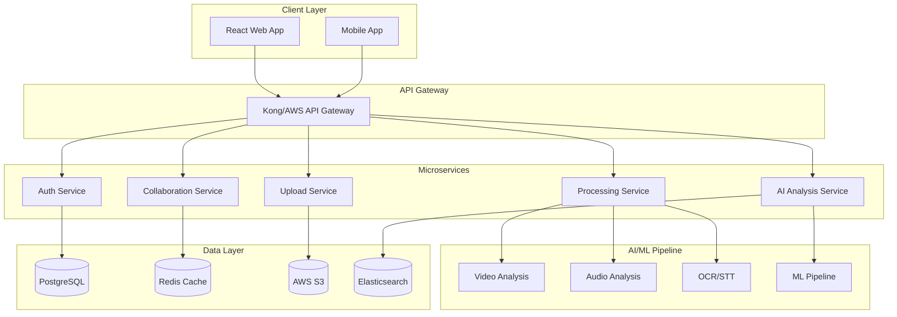

# Re:View (리:뷰) - Product Requirements Document v2.0
## AI-Powered Broadcast QC & Post-Mortem Platform

**Version**: 2.0.0
**Last Updated**: 2025-11-03
**Status**: Draft
**Author**: Product Strategy Team
**Approval**: Pending

---

## Executive Summary

Re:View는 라이브 방송 제작팀을 위한 차세대 AI 기반 품질 관리 플랫폼입니다. 방송 후 수동적이고 파편화된 리뷰 프로세스를 자동화하고 통합하여, 제작팀이 데이터 기반으로 방송 품질을 지속적으로 개선할 수 있게 합니다.

### 핵심 가치 제안 (Value Proposition)
- **시간 절감**: 8시간 → 30분 (리뷰 시간 94% 단축)
- **오류 감소**: 반복 실수 85% 감소
- **ROI**: 6개월 내 투자 회수

---

## 1. 비즈니스 컨텍스트

### 1.1 시장 기회

**시장 규모**
- **TAM (Total Addressable Market)**: $2.8B (글로벌 방송 QC 시장)
- **SAM (Serviceable Addressable Market)**: $450M (라이브 스포츠/이벤트)
- **SOM (Serviceable Obtainable Market)**: $45M (5년차 목표)

**시장 성장률**: 연평균 12% (2024-2029)

### 1.2 경쟁 환경

| 경쟁사 | 강점 | 약점 | Re:View 차별화 |
|--------|------|------|----------------|
| Telestream VIDCHECKER | 기술 QC 정확도 | 높은 가격, 복잡성 | AI 자동화, 협업 기능 |
| Adobe Prelude | Adobe 생태계 | 라이브 특화 부족 | 라이브 방송 최적화 |
| Frame.io | 협업 기능 | AI 분석 부재 | AI + 협업 통합 |

### 1.3 비즈니스 목표

**Year 1 (2025)**
- 10개 메이저 프로덕션 확보
- ARR $1.2M 달성
- NPS 50+ 달성

**Year 3 (2027)**
- 100+ 고객사
- ARR $15M
- 시장 점유율 10%

---

## 2. 제품 전략

### 2.1 제품 비전
"모든 방송이 이전보다 더 나은 품질로 제작되는 세상"

### 2.2 미션
AI와 협업 기술을 통해 방송 제작팀이 실수로부터 빠르게 학습하고 지속적으로 개선할 수 있는 플랫폼 제공

### 2.3 전략적 원칙
1. **Data-Driven**: 모든 결정은 측정 가능한 데이터 기반
2. **User-Centric**: 방송 전문가의 워크플로우 중심 설계
3. **Scalable**: 클라우드 네이티브 아키텍처
4. **Secure**: 방송 콘텐츠 보안 최우선

---

## 3. 사용자 페르소나 (상세)

### 3.1 Primary Persona: PD 김현준 (38세)

**배경**
- 15년 경력 방송 PD
- 주당 2-3개 라이브 방송 담당
- 팀원 15명 관리

**Pain Points**
- 방송 후 리뷰에 8시간 소요
- 팀별 피드백 통합 어려움
- 반복되는 실수 추적 불가

**Goals**
- 리뷰 시간 단축
- 객관적 품질 지표 확보
- 팀 성과 향상

**Success Metrics**
- 리뷰 시간 < 1시간
- 월간 오류율 20% 감소

### 3.2 Secondary Personas

**TD 이준호 (42세)**
- 기술적 오류 즉시 파악 필요
- 스위칭 판단 검증 요구

**오디오 엔지니어 박서연 (35세)**
- 오디오 피크/밸런스 자동 감지 필요
- 구간별 레벨 리포트 요구

---

## 4. 상세 기능 명세

### 4.1 핵심 기능 (MVP - 3개월)

#### 4.1.1 영상 처리 파이프라인

```yaml
기능 ID: CORE-001
기능명: 비디오 인제스트 & 프로세싱
설명: 대용량 영상 파일 업로드 및 처리
기술 요구사항:
  - 지원 포맷: MP4, MOV, MXF, ProRes
  - 최대 파일 크기: 500GB
  - 처리 속도: 실시간의 4배속
  - 동시 처리: 10개 파일
성능 지표:
  - 업로드: 1Gbps 네트워크 기준 100GB/15분
  - 처리: 1시간 영상 15분 내 완료
```

#### 4.1.2 AI 분석 엔진

```yaml
기능 ID: CORE-002
기능명: Multi-Modal AI Analysis
모듈별 상세:

  비디오 분석:
    - 블랙/프리즈 감지: 정확도 99.9%
    - 씬 체인지 감지: 정확도 98%
    - 포커스 품질: 정확도 95%
    - 처리 속도: 0.5x 실시간

  오디오 분석:
    - 피크 감지: -3dB 임계값
    - 노이즈 플로어: -60dB
    - 다이나믹 레인지: 측정 및 시각화
    - STT 정확도: 95% (한국어/영어)

  그래픽 분석:
    - OCR 정확도: 98% (영문), 95% (한글)
    - 그래픽 감지: 99% recall
    - 타이밍 분석: 프레임 단위
```

#### 4.1.3 협업 타임라인

```yaml
기능 ID: CORE-003
기능명: Collaborative Review Timeline
핵심 기능:
  - 멀티트랙 타임라인 (4개 레이어)
  - 실시간 동기화 (WebSocket)
  - 타임코드 정확도: 프레임 단위
  - 코멘트 시스템:
    - @멘션 알림
    - #태그 분류
    - 우선순위 설정
    - 해결 상태 추적
UI/UX 요구사항:
  - 반응 시간: <100ms
  - 동시 사용자: 20명
  - 브라우저 호환: Chrome, Safari, Edge
```

### 4.2 고급 기능 (Phase 2 - 6개월)

#### 4.2.1 실시간 대시보드

```yaml
기능 ID: ADV-001
기능명: Real-time Analytics Dashboard
메트릭:
  - 오류 트렌드 (일/주/월)
  - 팀별 성과 지표
  - 카테고리별 이슈 분포
  - 개선율 추적
시각화:
  - 히트맵
  - 시계열 차트
  - 파레토 차트
```

#### 4.2.2 AI 학습 시스템

```yaml
기능 ID: ADV-002
기능명: Custom AI Training
기능:
  - 고객별 오류 패턴 학습
  - 자동 임계값 조정
  - False Positive 감소
  - 업계별 특화 모델
```

### 4.3 엔터프라이즈 기능 (Phase 3 - 12개월)

```yaml
기능 ID: ENT-001
기능명: Multi-Camera Review (V-MTR)
설명: 모든 카메라 앵글 동시 리뷰
요구사항:
  - 최대 16개 카메라 동기화
  - 스위칭 결정 비교 분석
  - What-if 시나리오
```

---

## 5. 기술 아키텍처

### 5.1 시스템 아키텍처



### 5.2 기술 스택 상세

**Backend**
```yaml
Core Framework: Python 3.11+ with FastAPI
Why:
  - Async support for high concurrency
  - Native ML library integration
  - Strong typing with Pydantic

Message Queue: RabbitMQ/AWS SQS
Why:
  - Reliable task processing
  - Scalable video processing pipeline

Cache: Redis
Why:
  - Session management
  - Real-time collaboration
  - API rate limiting
```

**AI/ML Stack**
```yaml
Video Processing:
  - OpenCV 4.8+
  - FFmpeg 6.0
  - MediaPipe

Audio Processing:
  - Librosa 0.10+
  - PyDub
  - Essentia

ML Framework:
  - PyTorch 2.0+
  - Transformers (Hugging Face)
  - ONNX Runtime (for inference)

STT/OCR:
  - Whisper (OpenAI)
  - PaddleOCR
  - Tesseract 5.0+
```

**Frontend**
```yaml
Framework: React 18+ with TypeScript
State Management: Redux Toolkit + RTK Query
UI Components: Ant Design + Custom
Video Player: Video.js with custom plugins
Real-time: Socket.io
Charting: D3.js + Recharts
```

**Infrastructure**
```yaml
Cloud Provider: AWS (Primary) / Azure (Secondary)
Orchestration: Kubernetes (EKS)
CI/CD: GitLab CI / GitHub Actions
Monitoring: Datadog + Sentry
CDN: CloudFront
Video Processing: AWS Elemental MediaConvert
```

### 5.3 성능 요구사항

| 메트릭 | 목표 | 측정 방법 |
|--------|------|-----------|
| API 응답 시간 | p95 < 200ms | Datadog APM |
| 영상 처리 속도 | 4x 실시간 | CloudWatch |
| 동시 사용자 | 1000+ | Load Testing |
| 가용성 | 99.9% | Uptime Robot |
| 데이터 손실 | 0% | S3 Versioning |

### 5.4 보안 요구사항

**데이터 보안**
- AES-256 암호화 (저장 시)
- TLS 1.3 (전송 시)
- AWS KMS 키 관리

**접근 제어**
- OAuth 2.0 / SAML 2.0
- RBAC (Role-Based Access Control)
- MFA (Multi-Factor Authentication)

**컴플라이언스**
- GDPR 준수
- SOC 2 Type II
- ISO 27001

**콘텐츠 보호**
- DRM 지원
- 워터마킹
- 접근 로그 감사

---

## 6. 데이터 전략

### 6.1 데이터 모델

```sql
-- Core Entities
CREATE TABLE projects (
    id UUID PRIMARY KEY,
    name VARCHAR(255),
    organization_id UUID,
    created_at TIMESTAMP,
    status ENUM('processing', 'ready', 'archived')
);

CREATE TABLE videos (
    id UUID PRIMARY KEY,
    project_id UUID REFERENCES projects(id),
    file_url TEXT,
    duration_seconds INTEGER,
    frame_rate DECIMAL,
    resolution VARCHAR(20),
    codec VARCHAR(50)
);

CREATE TABLE analysis_markers (
    id UUID PRIMARY KEY,
    video_id UUID REFERENCES videos(id),
    type ENUM('video', 'audio', 'graphic', 'story'),
    subtype VARCHAR(50),
    timecode_start DECIMAL,
    timecode_end DECIMAL,
    severity ENUM('critical', 'major', 'minor', 'info'),
    confidence_score DECIMAL,
    metadata JSONB
);

CREATE TABLE comments (
    id UUID PRIMARY KEY,
    project_id UUID REFERENCES projects(id),
    user_id UUID REFERENCES users(id),
    timecode DECIMAL,
    content TEXT,
    tags TEXT[],
    mentions UUID[],
    status ENUM('open', 'resolved', 'wontfix'),
    created_at TIMESTAMP
);
```

### 6.2 데이터 거버넌스

**데이터 라이프사이클**
- Hot Storage (0-30일): SSD, 즉시 접근
- Warm Storage (31-90일): HDD, 몇 분 내 접근
- Cold Storage (91일+): Glacier, 몇 시간 내 접근
- 삭제 정책: 고객 요청 시 또는 계약 종료 후 30일

**프라이버시**
- PII 자동 마스킹
- 데이터 익명화
- 접근 로그 90일 보관
- GDPR 삭제 요청 24시간 내 처리

### 6.3 분석 및 인사이트

**수집 메트릭**
- 사용자 행동 (Mixpanel)
- 시스템 성능 (Datadog)
- 오류 추적 (Sentry)
- 비즈니스 메트릭 (Custom)

**ML 모델 개선**
- A/B 테스트 프레임워크
- 모델 성능 모니터링
- 자동 재학습 파이프라인
- 드리프트 감지

---

## 7. 통합 전략

### 7.1 방송 시스템 통합

```yaml
지원 시스템:
  Production Switchers:
    - BlackMagic ATEM
    - Ross Video
    - Grass Valley

  MAM Systems:
    - Avid MediaCentral
    - Adobe Premiere
    - DaVinci Resolve

  Streaming Platforms:
    - Wowza
    - AWS MediaLive
    - YouTube Live API
```

### 7.2 API 전략

**REST API**
```yaml
Base URL: https://api.re-view.io/v1
Authentication: Bearer Token (JWT)
Rate Limiting: 1000 req/min
Documentation: OpenAPI 3.0
```

**주요 엔드포인트**
```http
POST   /projects                 # 프로젝트 생성
POST   /projects/{id}/videos     # 영상 업로드
GET    /projects/{id}/analysis   # 분석 결과 조회
POST   /projects/{id}/comments   # 코멘트 작성
GET    /projects/{id}/report     # 리포트 생성
```

**Webhook Events**
```yaml
Events:
  - video.uploaded
  - analysis.completed
  - comment.created
  - report.generated
```

### 7.3 SDK 제공

```yaml
Languages:
  - Python SDK
  - Node.js SDK
  - Go SDK

Features:
  - Auto-retry
  - Error handling
  - Streaming upload
  - Progress tracking
```

---

## 8. 위험 관리

### 8.1 기술적 위험

| 위험 | 영향도 | 확률 | 완화 전략 |
|------|--------|------|-----------|
| AI 모델 정확도 부족 | High | Medium | 지속적 학습, 수동 검증 옵션 |
| 대용량 파일 처리 실패 | High | Low | 청크 업로드, 재시도 메커니즘 |
| 실시간 동기화 지연 | Medium | Medium | WebSocket 풀백, 최종 일관성 |
| 클라우드 비용 초과 | Medium | Medium | 자동 스케일링, 비용 알림 |

### 8.2 비즈니스 위험

| 위험 | 영향도 | 확률 | 완화 전략 |
|------|--------|------|-----------|
| 느린 시장 채택 | High | Medium | 프리미엄, POC 프로그램 |
| 경쟁사 모방 | Medium | High | 특허 출원, 빠른 혁신 |
| 규제 변화 | Low | Low | 법무 자문, 컴플라이언스 팀 |

---

## 9. 출시 전략

### 9.1 MVP 출시 (3개월)

**Phase 1: Alpha (Month 1-2)**
- 내부 테스트
- 5개 선별 고객
- 핵심 기능 검증

**Phase 2: Beta (Month 3)**
- 20개 고객
- 피드백 수집
- 버그 수정

**Phase 3: GA (Month 4)**
- 공식 출시
- 마케팅 캠페인
- 고객 지원 체계

### 9.2 Go-to-Market

**채널 전략**
1. Direct Sales (Enterprise)
2. Partner Channel (SI/Reseller)
3. Self-Service (SMB)

**가격 전략**
```yaml
Starter:
  가격: $499/월
  사용자: 5명
  스토리지: 500GB
  분석: 50시간/월

Professional:
  가격: $1,999/월
  사용자: 20명
  스토리지: 5TB
  분석: 300시간/월

Enterprise:
  가격: Custom
  사용자: Unlimited
  스토리지: Unlimited
  분석: Unlimited
  특전: SLA, 전담 지원
```

---

## 10. 성공 지표 (KPIs)

### 10.1 제품 메트릭

| 메트릭 | 목표 (Q1) | 목표 (Q4) | 측정 방법 |
|--------|-----------|-----------|-----------|
| MAU (Monthly Active Users) | 100 | 1,000 | Mixpanel |
| 분석 완료 시간 | <20분 | <15분 | 시스템 로그 |
| AI 정확도 | 90% | 95% | 수동 검증 |
| NPS Score | 40 | 60 | 분기별 설문 |

### 10.2 비즈니스 메트릭

| 메트릭 | 목표 (Year 1) | 측정 방법 |
|--------|---------------|-----------|
| ARR | $1.2M | Stripe/CRM |
| 고객 획득 비용 (CAC) | <$5,000 | 마케팅 비용/신규 고객 |
| LTV:CAC Ratio | 3:1 | 계산 |
| 월간 이탈률 | <5% | CRM |
| Gross Margin | 70% | 재무 보고서 |

### 10.3 사용자 메트릭

| 메트릭 | 목표 | 측정 방법 |
|--------|------|-----------|
| 첫 리포트 생성 시간 | <7일 | 제품 분석 |
| 주간 활성 사용률 | 60% | Mixpanel |
| 기능 채택률 | 80% | 기능별 사용 통계 |
| 지원 티켓/고객 | <2/월 | Zendesk |

---

## 11. 로드맵

### 2025 Q1-Q2: Foundation
- [x] MVP 개발 완료
- [ ] Alpha/Beta 테스트
- [ ] 첫 10개 고객 확보
- [ ] $500K 시드 펀딩

### 2025 Q3-Q4: Growth
- [ ] 모바일 앱 출시
- [ ] API 공개
- [ ] 50개 고객 확보
- [ ] Series A 준비

### 2026: Expansion
- [ ] 국제화 (일본/유럽)
- [ ] AI 모델 고도화
- [ ] 멀티카메라 리뷰
- [ ] 100+ 고객

### 2027: Market Leadership
- [ ] 업계 표준 확립
- [ ] M&A 기회 탐색
- [ ] IPO 준비

---

## 12. 팀 구성

### 12.1 현재 팀 (10명)

```yaml
Engineering (6):
  - Backend: 2
  - Frontend: 2
  - ML/AI: 2

Product (2):
  - PM: 1
  - UX Designer: 1

Business (2):
  - Sales: 1
  - Customer Success: 1
```

### 12.2 채용 계획 (Year 1)

```yaml
Q1:
  - Senior ML Engineer
  - DevOps Engineer

Q2:
  - Sales Manager
  - QA Engineer

Q3:
  - Marketing Manager
  - Customer Success Manager

Q4:
  - VP Engineering
  - Data Scientist
```

---

## 13. 예산

### 13.1 개발 비용 (Year 1)

| 항목 | 금액 (USD) |
|------|-----------|
| 인건비 | $1,200,000 |
| 인프라 (AWS) | $180,000 |
| ML/AI 도구 | $60,000 |
| 소프트웨어 라이선스 | $40,000 |
| **총 개발 비용** | **$1,480,000** |

### 13.2 운영 비용

| 항목 | 금액 (USD) |
|------|-----------|
| 마케팅 | $200,000 |
| 영업 | $150,000 |
| 고객 지원 | $100,000 |
| 일반 관리 | $120,000 |
| **총 운영 비용** | **$570,000** |

### 13.3 총 예산
**Year 1 Total: $2,050,000**

---

## 14. 리스크와 가정

### 14.1 주요 가정
- 방송사가 클라우드 기반 솔루션 수용
- AI 정확도가 인간 검토자의 90% 수준 달성 가능
- 영상 처리 비용이 연 20% 감소

### 14.2 의존성
- AWS/클라우드 서비스 안정성
- ML 모델 학습을 위한 충분한 데이터
- 방송 업계 표준 준수

---

## 15. 부록

### 15.1 용어 정의

| 용어 | 정의 |
|------|------|
| PGM | Program Feed - 최종 방송 송출 영상 |
| QC | Quality Control - 품질 관리 |
| MAM | Media Asset Management |
| STT | Speech-to-Text - 음성 인식 |
| OCR | Optical Character Recognition - 문자 인식 |
| Dead Air | 의미 있는 콘텐츠가 없는 방송 구간 |

### 15.2 참조 문서
- [기술 아키텍처 상세](./tech_architecture.md)
- [API 명세서](./api_specification.md)
- [UI/UX 가이드](./ui_ux_guide.md)
- [데이터 모델 ERD](./data_model.md)

### 15.3 승인 이력

| 날짜 | 버전 | 승인자 | 비고 |
|------|------|--------|------|
| 2025-11-03 | 2.0 | Pending | 초안 작성 |

---

## 16. 다음 단계

1. **즉시 실행 (Week 1)**
   - [ ] 스테이크홀더 리뷰 미팅
   - [ ] 기술 POC 개발 시작
   - [ ] 첫 파일럿 고객 접촉

2. **단기 (Month 1)**
   - [ ] MVP 기능 우선순위 최종 확정
   - [ ] 개발팀 구성 완료
   - [ ] 인프라 설정

3. **중기 (Quarter 1)**
   - [ ] Alpha 버전 배포
   - [ ] 고객 피드백 수집
   - [ ] Series A 준비

---

*이 문서는 Living Document로서 제품 개발 과정에서 지속적으로 업데이트됩니다.*

**문의사항**: product@re-view.io