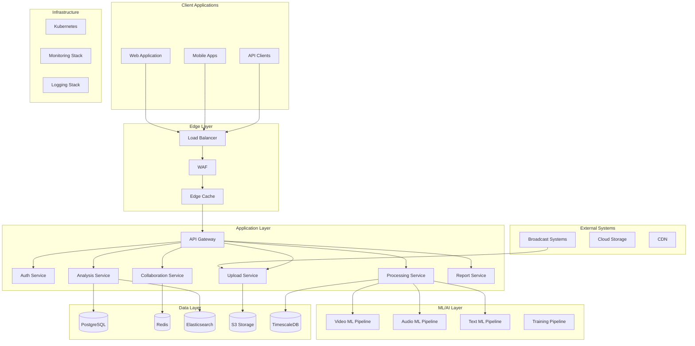

# Re:View 기술 아키텍처 상세 명세서

**Version**: 1.0.0
**Last Updated**: 2025-11-03

---

## 1. 시스템 아키텍처 개요

### 1.1 아키텍처 원칙

- **Microservices**: 독립적으로 배포 가능한 서비스 단위
- **Event-Driven**: 비동기 이벤트 기반 통신
- **Cloud-Native**: 컨테이너화 및 오케스트레이션
- **API-First**: 모든 기능은 API를 통해 접근
- **Security by Design**: 보안 우선 설계

### 1.2 High-Level Architecture



---

## 2. 서비스별 상세 설계

### 2.1 Auth Service

**책임**: 인증, 인가, 세션 관리

```yaml
기술 스택:
  - Framework: FastAPI
  - Auth: OAuth 2.0, JWT
  - Session: Redis
  - MFA: TOTP

API Endpoints:
  POST /auth/login
  POST /auth/logout
  POST /auth/refresh
  GET  /auth/validate
  POST /auth/mfa/setup
  POST /auth/mfa/verify

성능 요구사항:
  - Response Time: <100ms
  - Throughput: 10,000 req/s
  - Session TTL: 24 hours
```

### 2.2 Upload Service

**책임**: 대용량 파일 업로드 관리

```yaml
기술 스택:
  - Framework: Node.js + Express
  - Upload: Resumable.js
  - Storage: AWS S3 Multipart
  - Queue: AWS SQS

Features:
  - Chunked Upload
  - Resume on Failure
  - Progress Tracking
  - Virus Scanning

Limits:
  - Max File Size: 500GB
  - Chunk Size: 100MB
  - Concurrent Uploads: 10/user
```

### 2.3 Processing Service

**책임**: 비디오 프로세싱 및 트랜스코딩

```yaml
기술 스택:
  - Framework: Python + Celery
  - Video: FFmpeg, OpenCV
  - Queue: RabbitMQ
  - Storage: S3 + CloudFront

Pipeline:
  1. Validate Format
  2. Extract Metadata
  3. Generate Proxies
  4. Create Thumbnails
  5. Segment for Analysis
  6. Trigger ML Pipeline

Performance:
  - Processing Speed: 4x realtime
  - Parallel Workers: Auto-scaling (2-50)
  - Queue Depth: Max 1000
```

### 2.4 Analysis Service

**책임**: AI/ML 분석 조율 및 결과 저장

```yaml
기술 스택:
  - Framework: FastAPI
  - ML Orchestration: Kubeflow
  - Model Serving: TorchServe
  - Feature Store: Feast

Workflow:
  1. Receive Processing Complete Event
  2. Distribute to ML Pipelines
  3. Aggregate Results
  4. Calculate Confidence Scores
  5. Store in Database
  6. Trigger Notifications

ML Models:
  - Video Quality: ResNet-50 (custom trained)
  - Scene Detection: TransNetV2
  - Audio Analysis: YAMNet
  - STT: Whisper Large
  - OCR: PaddleOCR
```

### 2.5 Collaboration Service

**책임**: 실시간 협업 기능

```yaml
기술 스택:
  - Framework: Node.js
  - WebSocket: Socket.io
  - State: Redis Pub/Sub
  - Persistence: PostgreSQL

Features:
  - Real-time Comments
  - Presence Awareness
  - Collaborative Cursors
  - Change Notifications
  - Conflict Resolution

Performance:
  - Latency: <50ms
  - Concurrent Users: 100/project
  - Message Rate: 1000/s
```

---

## 3. ML/AI 파이프라인

### 3.1 Video Analysis Pipeline

```python
class VideoAnalysisPipeline:
    def __init__(self):
        self.models = {
            'black_frame': BlackFrameDetector(),
            'freeze_frame': FreezeFrameDetector(),
            'scene_change': SceneChangeDetector(),
            'focus_quality': FocusQualityAnalyzer(),
            'camera_shake': CameraShakeDetector()
        }

    async def analyze(self, video_path: str) -> List[Marker]:
        markers = []

        # Extract frames
        frames = await self.extract_frames(video_path)

        # Parallel analysis
        tasks = []
        for name, model in self.models.items():
            tasks.append(model.analyze_async(frames))

        results = await asyncio.gather(*tasks)

        # Aggregate and filter
        for result in results:
            markers.extend(self.filter_markers(result))

        return markers
```

### 3.2 Audio Analysis Pipeline

```python
class AudioAnalysisPipeline:
    def __init__(self):
        self.sample_rate = 48000
        self.frame_length = 2048

    async def analyze(self, audio_path: str) -> AudioMetrics:
        # Load audio
        y, sr = librosa.load(audio_path, sr=self.sample_rate)

        # Parallel analysis
        metrics = await asyncio.gather(
            self.detect_peaks(y, sr),
            self.analyze_levels(y, sr),
            self.detect_silence(y, sr),
            self.analyze_balance(y, sr),
            self.transcribe_speech(audio_path)
        )

        return AudioMetrics(*metrics)
```

### 3.3 Text Analysis Pipeline

```python
class TextAnalysisPipeline:
    def __init__(self):
        self.ocr_model = PaddleOCR(use_angle_cls=True, lang='en')
        self.stt_model = whisper.load_model("large")

    async def analyze_graphics(self, frames: List[np.ndarray]) -> List[GraphicEvent]:
        events = []

        for idx, frame in enumerate(frames):
            # Detect graphics regions
            regions = await self.detect_graphic_regions(frame)

            for region in regions:
                # OCR on region
                text = self.ocr_model.ocr(region)

                if text:
                    events.append(GraphicEvent(
                        frame_idx=idx,
                        text=text,
                        confidence=text.confidence,
                        bbox=region.bbox
                    ))

        return events
```

---

## 4. 데이터베이스 설계

### 4.1 주요 스키마

```sql
-- Projects and Organizations
CREATE TABLE organizations (
    id UUID PRIMARY KEY DEFAULT gen_random_uuid(),
    name VARCHAR(255) NOT NULL,
    plan_type VARCHAR(50) NOT NULL,
    created_at TIMESTAMP NOT NULL DEFAULT NOW(),
    settings JSONB DEFAULT '{}'
);

CREATE TABLE projects (
    id UUID PRIMARY KEY DEFAULT gen_random_uuid(),
    organization_id UUID NOT NULL REFERENCES organizations(id),
    name VARCHAR(255) NOT NULL,
    description TEXT,
    created_by UUID NOT NULL REFERENCES users(id),
    created_at TIMESTAMP NOT NULL DEFAULT NOW(),
    status VARCHAR(50) NOT NULL DEFAULT 'active',
    metadata JSONB DEFAULT '{}'
);

-- Video and Analysis
CREATE TABLE videos (
    id UUID PRIMARY KEY DEFAULT gen_random_uuid(),
    project_id UUID NOT NULL REFERENCES projects(id),
    original_filename VARCHAR(255) NOT NULL,
    s3_key VARCHAR(500) NOT NULL,
    file_size_bytes BIGINT NOT NULL,
    duration_ms INTEGER NOT NULL,
    width INTEGER NOT NULL,
    height INTEGER NOT NULL,
    fps DECIMAL(5,2) NOT NULL,
    codec VARCHAR(50),
    bitrate INTEGER,
    processing_status VARCHAR(50) NOT NULL DEFAULT 'pending',
    processed_at TIMESTAMP,
    metadata JSONB DEFAULT '{}'
);

CREATE TABLE analysis_results (
    id UUID PRIMARY KEY DEFAULT gen_random_uuid(),
    video_id UUID NOT NULL REFERENCES videos(id),
    analysis_type VARCHAR(50) NOT NULL,
    version VARCHAR(20) NOT NULL,
    started_at TIMESTAMP NOT NULL,
    completed_at TIMESTAMP,
    status VARCHAR(50) NOT NULL,
    result_data JSONB NOT NULL,
    confidence_score DECIMAL(3,2),
    error_message TEXT,
    INDEX idx_video_type (video_id, analysis_type)
);

-- Collaboration
CREATE TABLE comments (
    id UUID PRIMARY KEY DEFAULT gen_random_uuid(),
    project_id UUID NOT NULL REFERENCES projects(id),
    user_id UUID NOT NULL REFERENCES users(id),
    parent_id UUID REFERENCES comments(id),
    timecode_ms INTEGER NOT NULL,
    content TEXT NOT NULL,
    mentions UUID[] DEFAULT '{}',
    tags TEXT[] DEFAULT '{}',
    status VARCHAR(50) NOT NULL DEFAULT 'open',
    created_at TIMESTAMP NOT NULL DEFAULT NOW(),
    updated_at TIMESTAMP NOT NULL DEFAULT NOW(),
    resolved_by UUID REFERENCES users(id),
    resolved_at TIMESTAMP,
    INDEX idx_project_timecode (project_id, timecode_ms)
);

-- Markers (AI-detected issues)
CREATE TABLE markers (
    id UUID PRIMARY KEY DEFAULT gen_random_uuid(),
    video_id UUID NOT NULL REFERENCES videos(id),
    marker_type VARCHAR(50) NOT NULL,
    subtype VARCHAR(50),
    start_timecode_ms INTEGER NOT NULL,
    end_timecode_ms INTEGER NOT NULL,
    severity VARCHAR(20) NOT NULL,
    confidence DECIMAL(3,2) NOT NULL,
    description TEXT,
    metadata JSONB DEFAULT '{}',
    verified_by UUID REFERENCES users(id),
    verified_at TIMESTAMP,
    is_false_positive BOOLEAN DEFAULT FALSE,
    INDEX idx_video_timecode (video_id, start_timecode_ms)
);
```

### 4.2 인덱싱 전략

```sql
-- Performance-critical indexes
CREATE INDEX idx_markers_video_severity ON markers(video_id, severity);
CREATE INDEX idx_comments_mentions ON comments USING GIN(mentions);
CREATE INDEX idx_comments_tags ON comments USING GIN(tags);
CREATE INDEX idx_analysis_results_status ON analysis_results(status, created_at);

-- Full-text search
CREATE INDEX idx_comments_content_fts ON comments USING GIN(to_tsvector('english', content));
CREATE INDEX idx_markers_description_fts ON markers USING GIN(to_tsvector('english', description));
```

---

## 5. 인프라스트럭처

### 5.1 Kubernetes 설정

```yaml
# Deployment Example
apiVersion: apps/v1
kind: Deployment
metadata:
  name: analysis-service
  namespace: production
spec:
  replicas: 3
  strategy:
    type: RollingUpdate
    rollingUpdate:
      maxSurge: 1
      maxUnavailable: 0
  selector:
    matchLabels:
      app: analysis-service
  template:
    metadata:
      labels:
        app: analysis-service
    spec:
      containers:
      - name: analysis-service
        image: review-ai/analysis-service:v1.0.0
        ports:
        - containerPort: 8000
        env:
        - name: DATABASE_URL
          valueFrom:
            secretKeyRef:
              name: db-secret
              key: url
        resources:
          requests:
            memory: "2Gi"
            cpu: "1"
          limits:
            memory: "4Gi"
            cpu: "2"
        livenessProbe:
          httpGet:
            path: /health
            port: 8000
          initialDelaySeconds: 30
          periodSeconds: 10
        readinessProbe:
          httpGet:
            path: /ready
            port: 8000
          initialDelaySeconds: 5
          periodSeconds: 5
```

### 5.2 Auto-scaling 정책

```yaml
# HPA Configuration
apiVersion: autoscaling/v2
kind: HorizontalPodAutoscaler
metadata:
  name: processing-service-hpa
spec:
  scaleTargetRef:
    apiVersion: apps/v1
    kind: Deployment
    name: processing-service
  minReplicas: 2
  maxReplicas: 50
  metrics:
  - type: Resource
    resource:
      name: cpu
      target:
        type: Utilization
        averageUtilization: 70
  - type: Resource
    resource:
      name: memory
      target:
        type: Utilization
        averageUtilization: 80
  - type: Pods
    pods:
      metric:
        name: rabbitmq_queue_depth
      target:
        type: AverageValue
        averageValue: "30"
```

---

## 6. 보안 아키텍처

### 6.1 네트워크 보안

```yaml
Security Layers:
  1. CloudFlare (DDoS Protection)
  2. AWS WAF (Application Firewall)
  3. AWS Shield (Infrastructure Protection)
  4. Network Segmentation (VPC, Subnets)
  5. Security Groups (Micro-segmentation)

Network Policies:
  - Ingress: Allow only from Load Balancer
  - Egress: Whitelist external services
  - Inter-service: mTLS
  - Database: Private subnet only
```

### 6.2 데이터 보안

```yaml
Encryption:
  At Rest:
    - S3: AES-256 with KMS
    - Database: TDE (Transparent Data Encryption)
    - EBS: Volume encryption

  In Transit:
    - TLS 1.3 everywhere
    - Certificate pinning for mobile
    - mTLS for service-to-service

Key Management:
  - AWS KMS for master keys
  - Vault for application secrets
  - Rotation every 90 days
  - Hardware Security Module (HSM) for critical keys
```

### 6.3 접근 제어

```yaml
Authentication:
  - OAuth 2.0 / OIDC
  - SAML 2.0 (Enterprise SSO)
  - MFA (TOTP, WebAuthn)
  - Session management (Redis)

Authorization:
  - RBAC (Role-Based Access Control)
  - ABAC (Attribute-Based Access Control)
  - Resource-level permissions
  - API rate limiting

Audit:
  - All API calls logged
  - Database query audit
  - File access tracking
  - Compliance reports (SOC2, GDPR)
```

---

## 7. 모니터링 및 관측성

### 7.1 모니터링 스택

```yaml
Metrics:
  - Prometheus (Time-series metrics)
  - Grafana (Visualization)
  - Custom dashboards per service

Logging:
  - Fluentd (Log collection)
  - Elasticsearch (Log storage)
  - Kibana (Log analysis)

Tracing:
  - OpenTelemetry (Instrumentation)
  - Jaeger (Distributed tracing)
  - Service dependency mapping

Alerting:
  - PagerDuty (Incident management)
  - Slack (Team notifications)
  - Email (Stakeholder updates)
```

### 7.2 핵심 메트릭

```yaml
System Metrics:
  - CPU, Memory, Disk, Network
  - Container/Pod health
  - Queue depths
  - Database connections

Application Metrics:
  - Request rate, latency, errors
  - Processing queue length
  - ML model inference time
  - Upload/download speeds

Business Metrics:
  - Active users
  - Videos processed/hour
  - Analysis accuracy
  - Customer satisfaction (NPS)
```

---

## 8. 성능 최적화

### 8.1 캐싱 전략

```yaml
CDN (CloudFront):
  - Static assets
  - Processed videos
  - Report PDFs
  TTL: 1 year (versioned assets)

Redis Cache:
  - Session data
  - API responses
  - Real-time collaboration state
  TTL: 5 minutes - 24 hours

Application Cache:
  - ML model predictions
  - Database query results
  - Computed analytics
  TTL: 1-60 minutes
```

### 8.2 데이터베이스 최적화

```yaml
Query Optimization:
  - Prepared statements
  - Connection pooling
  - Read replicas for analytics
  - Partitioning by date

Performance Tuning:
  - Vacuum regularly
  - Update statistics
  - Index maintenance
  - Query plan analysis
```

---

## 9. 재해 복구 (DR)

### 9.1 백업 전략

```yaml
Database:
  - Full backup: Daily
  - Incremental: Hourly
  - Point-in-time recovery: 7 days
  - Cross-region replication

Object Storage:
  - S3 versioning enabled
  - Cross-region replication
  - Lifecycle policies
  - Glacier for archives

Application State:
  - Kubernetes etcd backup: Daily
  - Configuration backup: Git
  - Secrets backup: Vault snapshots
```

### 9.2 복구 절차

```yaml
RTO (Recovery Time Objective): 4 hours
RPO (Recovery Point Objective): 1 hour

DR Plan:
  1. Detect failure (automated monitoring)
  2. Assess impact (incident commander)
  3. Initiate failover (DNS switch)
  4. Restore services (priority order)
  5. Validate functionality
  6. Communicate status
  7. Post-mortem analysis
```

---

## 10. 개발 및 배포

### 10.1 CI/CD 파이프라인

```yaml
Pipeline Stages:
  1. Code Commit
  2. Automated Tests
     - Unit tests
     - Integration tests
     - Security scanning
  3. Build & Package
     - Docker image
     - Helm charts
  4. Deploy to Staging
     - Smoke tests
     - Performance tests
  5. Manual Approval
  6. Deploy to Production
     - Blue-green deployment
     - Canary analysis
  7. Post-deployment
     - Health checks
     - Metrics validation

Tools:
  - GitLab CI / GitHub Actions
  - ArgoCD (GitOps)
  - Helm (Package management)
  - Terraform (Infrastructure as Code)
```

### 10.2 환경 전략

```yaml
Environments:
  Development:
    - Purpose: Active development
    - Data: Synthetic
    - Scale: Minimal

  Staging:
    - Purpose: Pre-production testing
    - Data: Anonymized production copy
    - Scale: 50% of production

  Production:
    - Purpose: Live service
    - Data: Real customer data
    - Scale: Auto-scaling

  DR:
    - Purpose: Disaster recovery
    - Data: Replicated from production
    - Scale: 100% capacity (standby)
```

---

이 기술 아키텍처 문서는 Re:View 플랫폼의 기술적 구현을 위한 상세한 청사진을 제공합니다. 각 섹션은 독립적으로 참조 가능하며, 개발팀이 실제 구현 시 참고할 수 있는 구체적인 지침을 포함하고 있습니다.